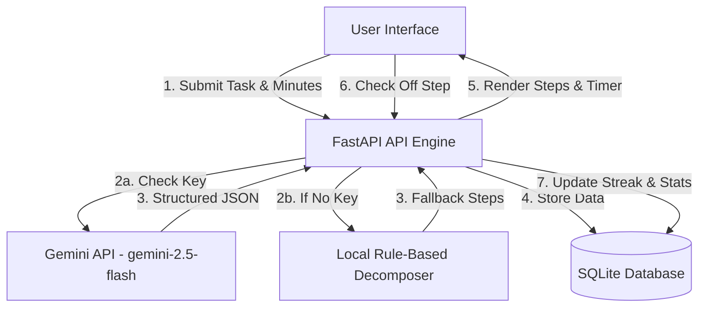

# WaitFree — ADHD Waiting Mode Task Breaker

WaitFree is a premium, high-craft web application designed to help people with ADHD overcome "waiting mode" paralysis. When you have an upcoming event (like a meeting, class, or flight), it's common to feel "frozen" and unable to start other tasks. WaitFree breaks down your target task into extremely small, action-oriented steps that take **under 2 minutes each** to complete, helping you build momentum without feeling overwhelmed.

## System Architecture



---

## Features

- **Cyberpunk HUD Design System:** Translucent glassmorphic dark-theme UI tailored to minimize cognitive load and focus attention.
- **Sub-2-Minute Task Decomposer:** Uses Gemini AI to break down complex tasks into atomic units.
- **Local Fallback Engine:** Smart keyword-based breakdown algorithm that works out-of-the-box offline without an API key.
- **Focus Timer Mode:** A central HUD circular animation timer counts down the 2 minutes for the active step.
- **Analytics & Streaks:** Tracks completed steps and maintains a daily streak log to gamify task initiation.

---

## Tech Stack

- **Backend:** Python 3, FastAPI, Uvicorn
- **Database:** SQLite (Built-in standard library)
- **Frontend:** Vanilla HTML5, Vanilla CSS3 (Custom Grid, CSS Variables, OKLCH theme), Vanilla JS
- **AI Integration:** Google GenAI SDK (`google-genai`)

---

## Installation & Setup

### 1. Clone & Navigate
```bash
cd "/Users/nishantbhavsar/Projects/WaitFree"
```

### 2. Set Up Virtual Environment & Dependencies
```bash
python3 -m venv venv
source venv/bin/activate
pip install -r requirements.txt
```

### 3. Set Up API Keys (Optional)
To use the generative task breaker, set your Gemini API key:
```bash
export GEMINI_API_KEY="your_api_key_here"
```
*If not set, the system automatically runs the local rule-based task breaker.*

### 4. Run the Server
```bash
python3 main.py
```
Open your browser and navigate to: `http://localhost:8000`

---

## Running Automated Tests
```bash
./venv/bin/pytest test_main.py
```
